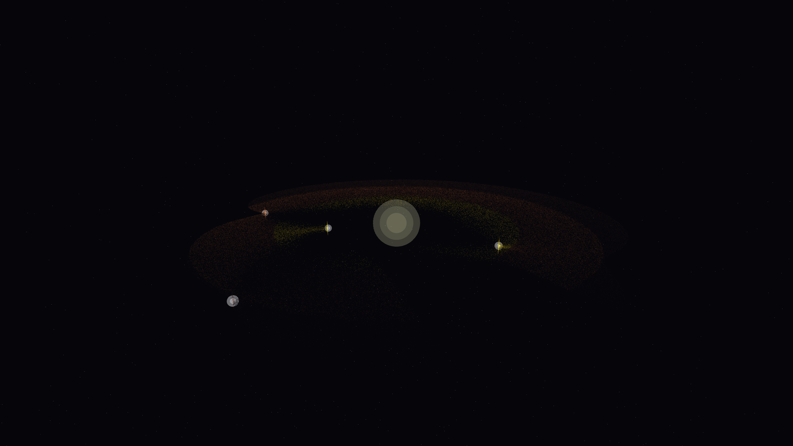

# protoplanetary_clump_void

## Metadata
- **Date**: 2026-05-06
- **Theme**: Protoplanetary disk, gravitational instability, planet birth, beautiful night sky.
- **Technique**: 3D simulation of a young stellar system's accretion disk using 180,000 particles. Features Keplerian orbital dynamics and local gravitational clumping around hidden attractor points (proto-planets). Multi-pass additive rendering with a Solar Gold and Rusty Orange palette, high-intensity planetesimal cores, and a high-density background starfield. 60fps high-bitrate MP4.
- **Logic Lab Reference**: None

## Concept
A majestic vision of a cosmic cradle; a vast, golden swirling disk of dust is sculpted by invisible forces as bright, shimmering knots of light form in the resonance gaps, representing the birth of a new solar system against the deep obsidian night.

## Technical Details
- **Renderer**: P3D
- **Simulation**: particle.
- **Visuals**: additive blending, HSB spectral mapping, bloom-like highlights, prismatic color, dark-field contrast.
- **Animation**: 10 seconds at 60fps
