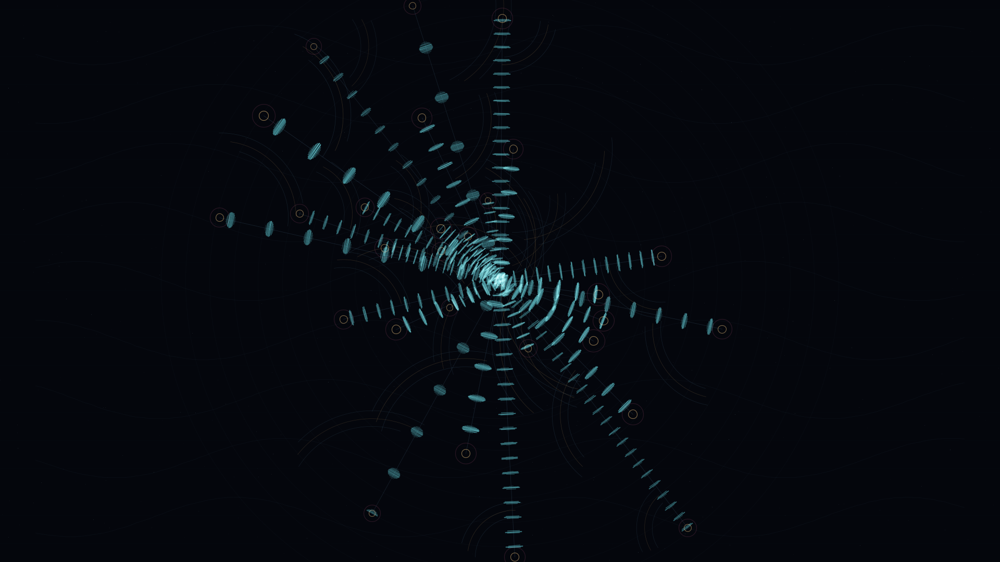

# pulsar_cartogram

## Metadata
- **Date**: 2026-05-03
- **Theme**: time signals, deep-space navigation, astronomical instrument record
- **Technique**: Polar pulsar placement, pulse train encoding, barycentric timing arcs, sparse chart grid synthesis

## Concept
A near-black astronomical cartogram turns rhythmic pulse arrivals into coordinates; cyan tick trains radiate from a central reference while amber timing arcs, rose halos, and faint chart lanes cross the quiet sky.

## Technical Details
- **Renderer**: P2D
- **Simulation**: Polar pulsar placement
- **Visuals**: pulse train encoding, barycentric timing arcs, sparse chart grid synthesis
