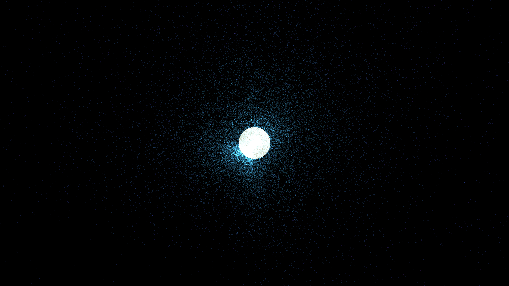

# pulsar_magnetosphere_flux

## Metadata
- **Date**: 2026-05-10
- **Theme**: Pulsar magnetosphere, rotating dipole, magnetic field lines, relativistic wind, beautiful night sky.
- **Technique**: 3D physics-based simulation of 60,000 particle tracers advected by a rotating magnetic dipole field. Implements the "twist" of magnetic field lines near the light cylinder and the transition to a radial relativistic pulsar wind. Features manual 3D-to-2D projection for performance and stability.
- **Logic Lab Reference**: None

## Concept
A majestic visualization of a pulsar's invisible power; silken filaments of electric cyan and royal purple light are twisted into complex, shimmering braids by the star's rapid rotation. As they reach the light cylinder, the magnetic ropes snap and surge outward into the deep obsidian night, creating a vast, glowing shroud of relativistic energy.

## Technical Details
- **Renderer**: P2D
- **Simulation**: particle, physics-based simulation.
- **Visuals**: persistent trails, dark-field contrast.
- **Animation**: 20 seconds at 60fps
