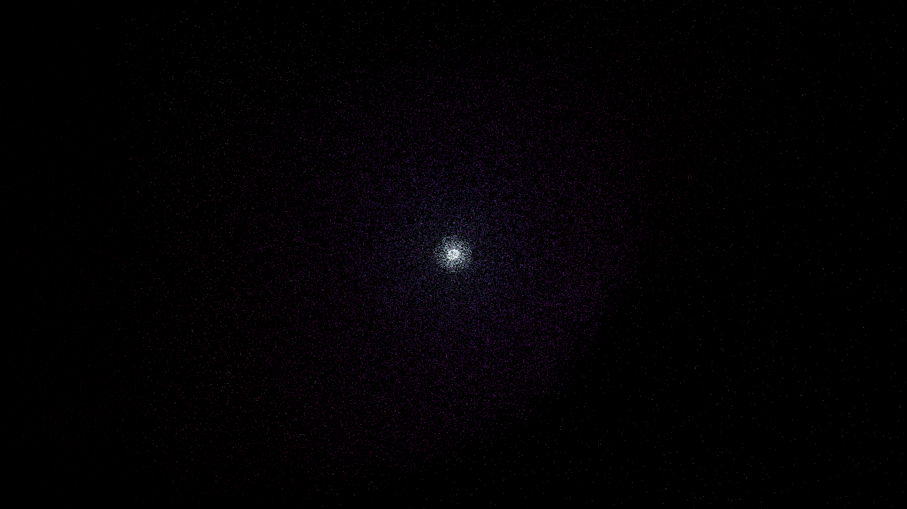

# pulsar_wind_nebula

## Metadata
- **Date**: 2026-05-07
- **Theme**: Pulsar wind, termination shock, synchrotron radiation, Crab Nebula filaments, beautiful night sky.
- **Technique**: 3D particle simulation (120,000 particles) using vectorized NumPy for performance. Particles are emitted from a central pulsing core as a relativistic wind. At the termination shock ($r \approx 280$), they enter a turbulent regime driven by multi-octave pseudo-noise and helical magnetic fields. Features multi-pass additive rendering with synchrotron-inspired color mapping (Cyan -> Violet -> Gold) and a high-density starfield (8,000 stars). 60fps high-bitrate MP4.
- **Logic Lab Reference**: None

## Concept
A blindingly bright, pulsing heart of a nebula; silken filaments of electric light swirl and knot into a complex, glowing web of energy against the deep obsidian night, representing the violent and beautiful environment around a rapidly rotating pulsar.

## Technical Details
- **Renderer**: P3D
- **Simulation**: Vectorized NumPy, NumPy, particle.
- **Visuals**: additive blending, HSB spectral mapping, bloom-like highlights, prismatic color, dark-field contrast.
- **Animation**: 10 seconds at 60fps
