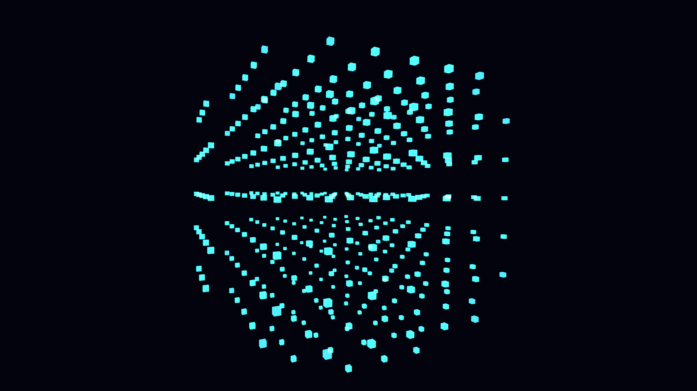

# pulsating_crystal_lattice_heart_3d

## Metadata
- **Date**: 2026-06-07
- **Theme**: A mesmerizing 3D lattice of interconnected geometric nodes that rhythmically expand and contract, pu
- **Technique**: A dense 3D grid of boxes whose sizes are modulated by both 3D OpenSimplex noise and a sinusoidal pulsing function driven by frame count. Nodes outside a defined spherical radius are culled to form a glowing core shape. Additive blending and dynamic HSB coloring give it the crystal energy look.
- **Logic Lab Reference**: 

## Concept
A mesmerizing 3D lattice of interconnected geometric nodes that rhythmically expand and contract, pulsating with energy like a living crystal heart.

## Technical Details
- **Renderer**: Unknown
- **Simulation**: Unknown
- **Visuals**: Unknown
- **Animation**: Unknown
