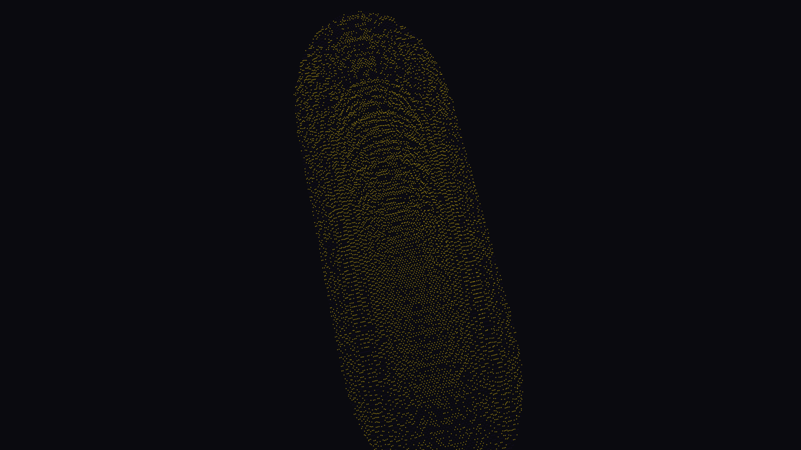

# quantum_chaos_billiard

## Metadata
- **Date**: 2026-05-12
- **Theme**: Quantum mechanics, chaos theory, stadium billiard, wavefunctions, quantum scarring, wave-particle duality.
- **Technique**: 2D wave equation simulation in a stadium geometry. High-density volumetric point rendering to visualize probability density. 15s 4K/60fps MP4 (1080p source).
- **Logic Lab Reference**: None

## Concept
Visualizes the emergence of quantum scars in a chaotic stadium billiard, where the wavefunction concentrates along classical periodic orbits.

## Technical Details
- **Renderer**: P3D
- **Simulation**: 2D wave equation simulation in a stadium geometry.
- **Visuals**: HSB spectral mapping, bloom-like highlights, prismatic color, dark-field contrast.
- **Animation**: 15 seconds at 60fps
