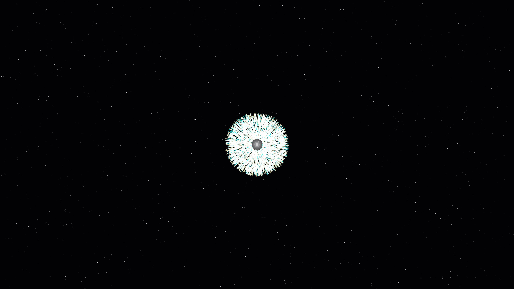

# quantum_chromatics

## Metadata
- **Date**: 2026-05-05
- **Theme**: Particle collisions, high-energy resonance, magnetic curvature, beautiful night sky
- **Technique**: Lorentz-force path simulation, stochastic collision fragmentation (5,000 particles), spectral decay mapping (White-Gold to Cyan/Magenta), high-density starfield rendering

## Concept
A high-energy visualization of quantum collisions where rhythmic bursts of 5,000 white-gold fragments shard into curved filaments of electric cyan and magenta; the shimmering spectral decay creates a vibrant, high-energy "sparkler" effect against a silent, star-dusted night sky.

## Technical Details
- **Renderer**: P2D
- **Simulation**: Lorentz-force path simulation
- **Visuals**: stochastic collision fragmentation (5,000 particles), spectral decay mapping (White-Gold to Cyan/Magenta), high-density starfield rendering
- **Animation**: 10s @ 60fps (typical)
