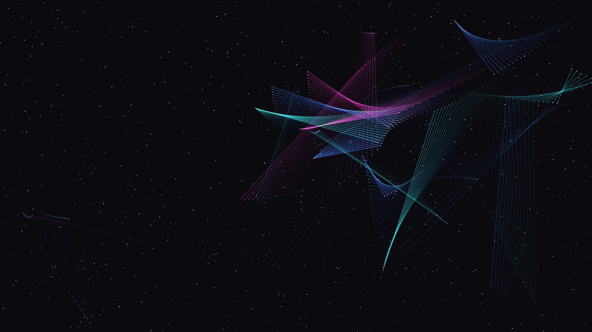

# quantum_entanglement

## Metadata
- **Date**: 2026-05-04
- **Theme**: Quantum physics, entanglement, non-locality, symmetrical energy, beautiful night sky
- **Technique**: Symmetrical mirrored particle systems, stochastic decoherence noise, persistence buffer trails, atmospheric starfield rendering

## Concept
Two shimmering particle systems in electric cyan and vibrant magenta dance in perfect synchronization across a central void; ghostly white threads connect the entangled pairs, while subtle decoherence noise and long-exposure trails create a sense of invisible connection and rhythmic harmony against a star-dusted night sky.

## Technical Details
- **Renderer**: P2D
- **Simulation**: Symmetrical mirrored particle systems
- **Visuals**: stochastic decoherence noise, persistence buffer trails, atmospheric starfield rendering
- **Animation**: 10s @ 60fps (typical)
