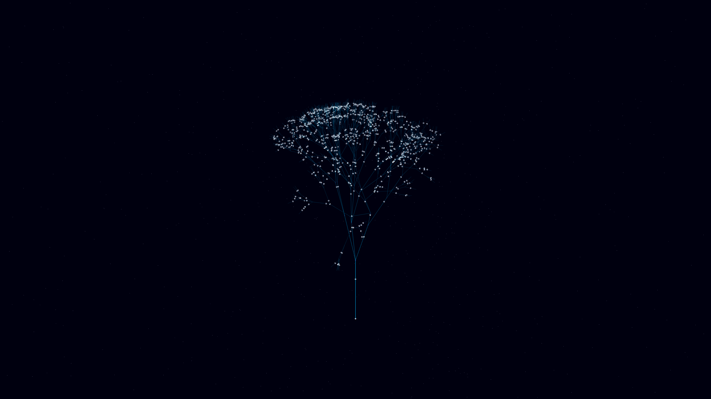

# quantum_entanglement_cascade

- **Date**: 2026-05-06
- **Theme**: Entanglement, non-locality, information cascade, beautiful night sky
- **Technique**: 3D simulation of a "Quantum Decision Tree" using a stochastic fractal branching algorithm. Features a dynamic information cascade system where energy pulses (represented as high-intensity white particles) traverse the silken teal branches, splitting and merging at each node. Multi-pass additive rendering with a Teal/Violet palette, shimmering node highlights, and a high-density background starfield. 60fps high-bitrate MP4.
- **Description**: A majestic, high-tech "tree of light" that pulses with the energy of quantum information; its delicate, silken branches stretch into the infinite intergalactic void, representing the non-local connections that bind the cosmos together against the deep obsidian night.

