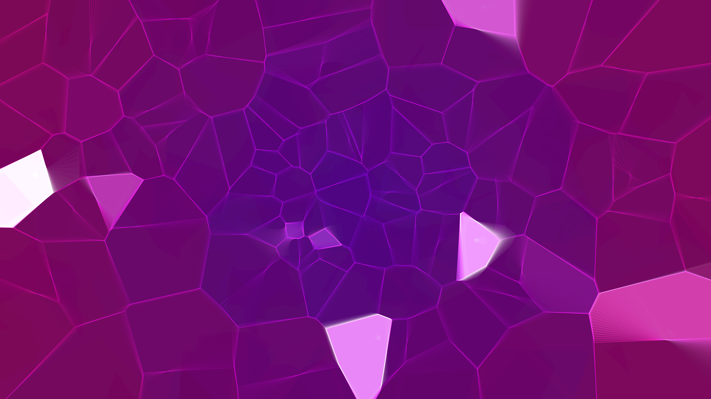

# quantum_foam

A generative visualization of the frantic, chaotic bubbling of spacetime at the Planck scale.

## Concept

This artwork explores the concept of "Quantum Foam"—the idea that at extremely small scales, spacetime is not a smooth fabric but a turbulent, frothing sea of energy. The work uses dynamic Voronoi tessellation to represent these fluctuating "bubbles" of reality, where cells constantly shift, merge, and burst into bright white flashes of high-energy discharge against the ultraviolet void of the cosmos.

## Technique

- **Dynamic Voronoi Tessellation**: The geometry of the foam is generated using a Voronoi diagram, where the seed points are driven by multi-layered noise and a subtle central attraction.
- **Energy Fluctuations**: Random energy bursts are assigned to cells, causing them to flash bright white and increase their stroke weight, simulating quantum fluctuations.
- **Additive Color Blending**: Multiple layers of glow and color are combined using additive blending (`py5.ADD`) to create a luminous, energetic feel.
- **Spectral Interpolation**: A color gradient from ultraviolet (#9900FF) to deep magenta (#FF00AA) is mapped to the cells based on their distance from the center and current energy level.
- **Volumetric Depth**: Overlapping alpha-blended cells create a sense of depth and "frothiness" in the subatomic void.

## Data

- **Date**: 2026-05-02
- **Theme**: Cosmos, Physics, Quantum Mechanics, Energy
- **Technique**: Dynamic Voronoi, Noise-driven seeds, Energy bursts, Additive blending
- **Format**: 10s Animation @ 60fps (MP4)
