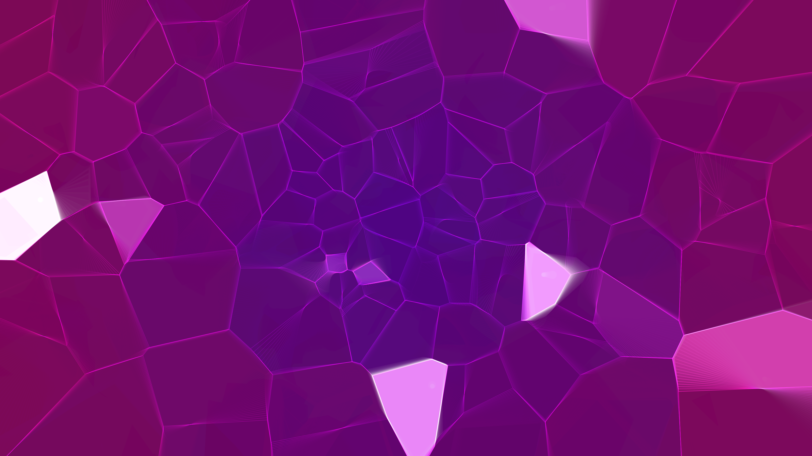

# quantum_foam

## Metadata
- **Date**: 2026-05-02
- **Theme**: cosmos, physics, quantum mechanics, energy.
- **Technique**: dynamic Voronoi tessellation, noise-driven seeds, energy bursts, additive blending.
- **Logic Lab Reference**: None

## Concept
The frantic, chaotic bubbling of spacetime at the Planck scale, rendered as a flickering froth of ultraviolet and magenta energy flashes.

## Technical Details
- **Renderer**: P2D
- **Simulation**: dynamic Voronoi tessellation, noise-driven seeds, energy bursts, additive blending.
- **Visuals**: additive blending, HSB spectral mapping, bloom-like highlights, prismatic color, dark-field contrast.
- **Animation**: 10 seconds at 60fps
