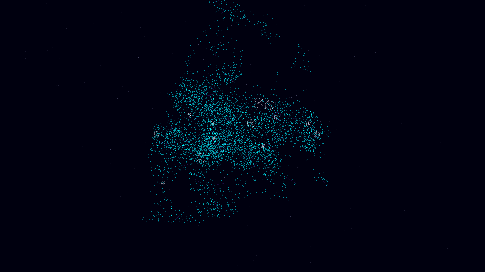

# quantum_foam_architecture

- **Date**: 2026-05-06
- **Theme**: Planck scale geometry, quantum foam, architectural abstraction, beautiful night sky
- **Technique**: 3D simulation of a boiling quantum vacuum using time-modulated volumetric noise. Features 40,000 "quanta" points that emerge and dissolve based on noise density thresholds. Active nodes are connected via a shimmering spectral proximity mesh and accompanied by recursive geometric box-structures. Multi-pass additive rendering with a Cyan/Violet palette and a high-density background starfield. 60fps high-bitrate MP4.
- **Description**: A mesmerizing, high-tech visualization of the fundamental structure of space-time; a boiling, geometric sea of light emerges and dissolves at the edge of perception, representing the microscopic jitter of reality against the deep obsidian night.

