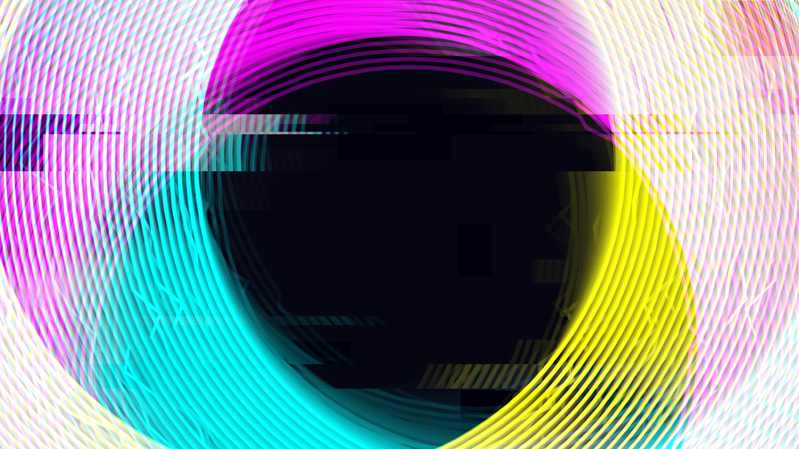

# quantum_interference_glitch

## Metadata
- **Date**: 2026-05-23
- **Theme**: The delicate, shimmering interference patterns of quantum waves that violently shear and split into bright RGB noise when observed.
- **Technique**: Procedural interference patterns mapped to saturated neon colors (Cyan, Magenta, Yellow), with sudden chaotic horizontal and vertical tearing using NumPy pixel manipulation. 15s 60fps MP4.
- **Logic Lab Reference**: None

## Concept
A visualization of a structured quantum system experiencing sudden decoherence. The piece begins with harmonious, overlapping interference rings from multiple wave sources, but as the timeline progresses, the "observation effect" intensifies, tearing the simulation apart through violent spatial shifts and RGB channel inversions.

## Technical Details
- **Renderer**: P2D / default py5
- **Simulation**: Additive blending of concentric rings moving along sinusoidal paths
- **Visuals**: Dynamic numpy buffer glitching (horizontal/vertical tearing, channel inversion)
- **Animation**: 15 seconds at 60fps
