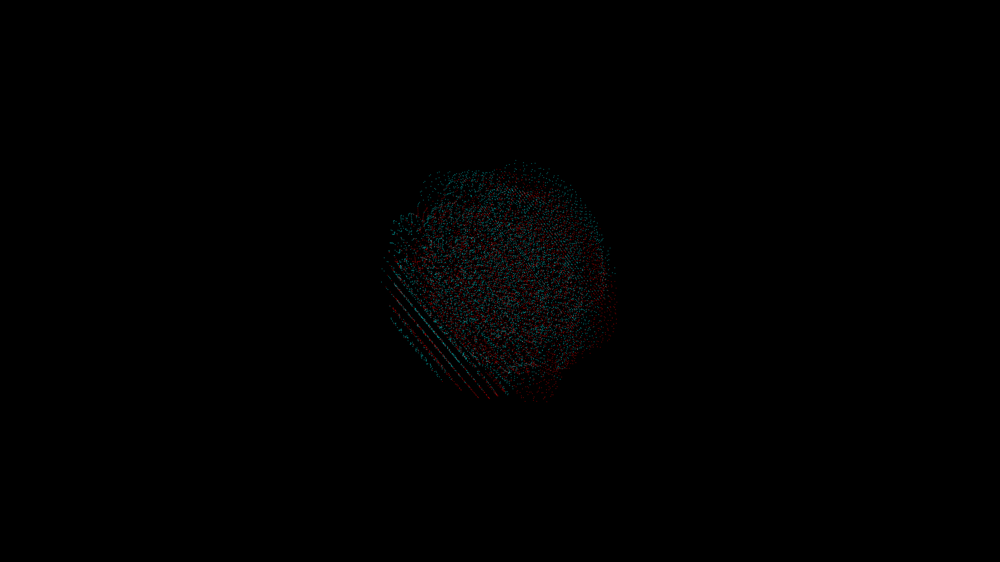

# quantum_interference_wave_particle_3d

## Metadata
- **Date**: 2026-05-29
- **Theme**: - **Date**: 2026-05-29 - **Theme**: A visual representation of wave-particle duality
- **Technique**: Unknown
- **Logic Lab Reference**: 

## Concept
- **Date**: 2026-05-29
- **Theme**: A visual representation of wave-particle duality. A rigid 3D lattice of particles collapses into swirling interference waves and reforms.
- **Technique**: A massive grid of py5 points. Their positions interpolate between a strict 3D grid layout and a complex combination of overlapping 3D sine waves.
- **Description**: An animated perfect rigid grid of white dots that suddenly bends and collapses into smooth, overlapping red and cyan ripples, then snaps back to a grid.

## Technical Details
- **Renderer**: Unknown
- **Simulation**: Unknown
- **Visuals**: Unknown
- **Animation**: Unknown
