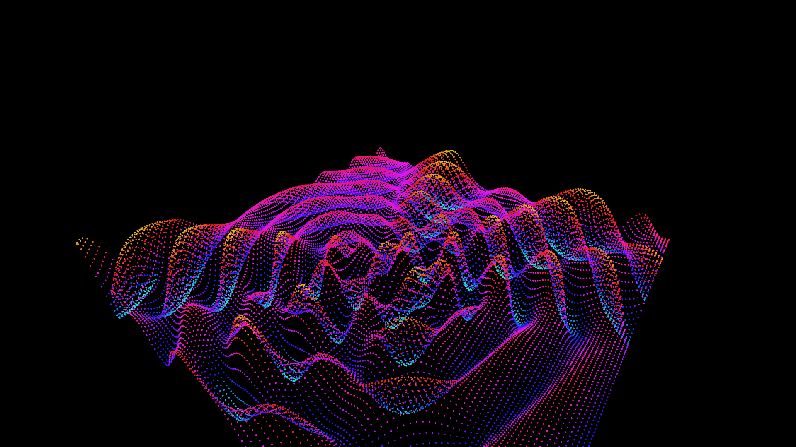

# quantum_interference_waves

## Metadata
- **Date**: 2026-05-23
- **Theme**: A vast grid of glowing dots hangs in space, undulating rhythmically like the surface of a liquid
- **Technique**: Unknown
- **Logic Lab Reference**: 

## Concept
A vast grid of glowing dots hangs in space, undulating rhythmically like the surface of a liquid. Three invisible sources are moving around the grid, continuously dropping stones into the water. 

Where their ripples intersect, they create beautiful, constantly shifting geometric peaks and valleys. The colors transition dynamically through the neon spectrum based on how high or low the wave peaks are, visualizing the complex mathematical beauty of wave interference and superposition.

## Technical Details
- **Renderer**: Unknown
- **Simulation**: Unknown
- **Visuals**: Unknown
- **Animation**: Unknown
