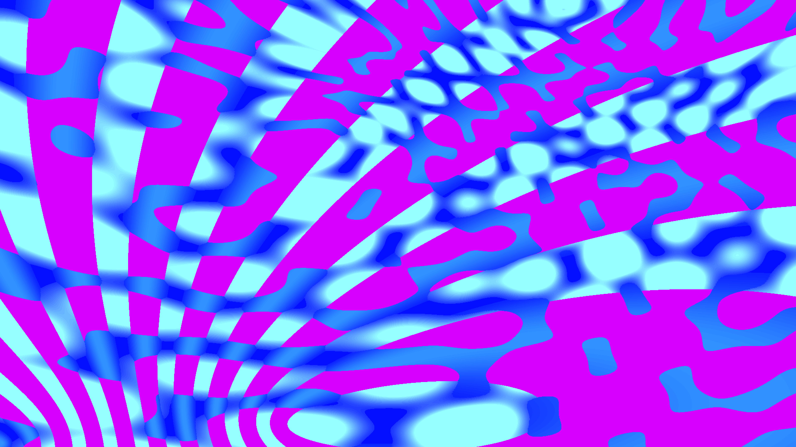

# quantum_lattice

## Metadata
- **Date**: 2026-05-04
- **Theme**: Quantum mechanics, probability fields, entanglement, wave-particle duality
- **Technique**: Complex wave superposition, energy-band quantization, probability-node extraction, optimized pixel-buffer rendering

## Concept
A vibrant field of shimmering interference fringes where waves of positron pink and electron blue overlap; bright gold quanta emerge at probability peaks against a dark vacuum indigo grid.

## Technical Details
- **Renderer**: P2D
- **Simulation**: Complex wave superposition
- **Visuals**: energy-band quantization, probability-node extraction, optimized pixel-buffer rendering
- **Animation**: 10s @ 60fps (typical)
