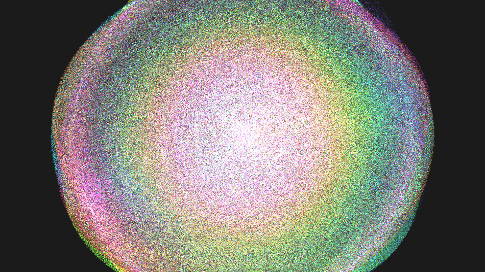

# quantum_orbital_electron_cloud

## Metadata
- **Date**: 2026-05-23
- **Theme**: A visualization of 50,000 subatomic particles forming a glowing quantum probability cloud around a c
- **Technique**: Unknown
- **Logic Lab Reference**: 

## Concept
A visualization of 50,000 subatomic particles forming a glowing quantum probability cloud around a central nucleus.

- **Date**: 2026-05-23
- **Theme**: Quantum mechanics, electron orbitals, probability density, particle physics.
- **Technique**: Uses NumPy to simulate 50,000 "electrons" in spherical coordinates ($r, \theta, \phi$). Instead of classical Newtonian gravity, the particles orbit chaotically and jitter. Their effective radii are modulated by a simplified spherical harmonic function (`abs(cos(2θ) * sin(3φ))`), which forces the random particle cloud to naturally group into distinct geometric "lobes" reminiscent of complex $d$ or $f$ atomic orbitals. The particles are drawn using `py5.POINTS` with additive blending, accumulating light where probability density is highest. The hue of each particle is tied to its distance from the nucleus. 15s 60fps MP4.
- **Description**: In the center of the void, a bright white nucleus pulses. Surrounding it is a vast, ethereal cloud of 50,000 glowing neon points. The points swarm chaotically, yet their collective motion forms beautiful, symmetrical flower-like lobes—the mathematical shapes of quantum electron orbitals. As the entire atomic structure slowly rotates, the density of the points creates blindingly bright, colorful regions of high probability, leaving dark voids where electrons are forbidden to exist.

## Technical Details
- **Renderer**: Unknown
- **Simulation**: Unknown
- **Visuals**: Unknown
- **Animation**: Contains animation details
