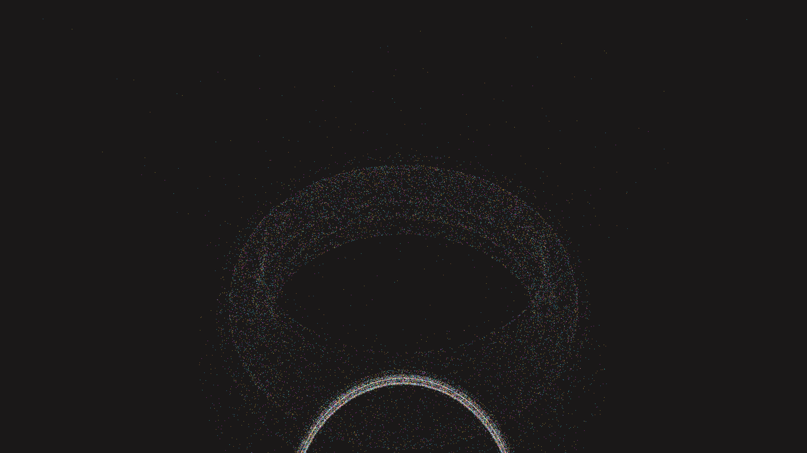

# quantum_singularity_shard_vortex_3d

## Metadata
- **Date**: 2026-06-07
- **Theme**: A 3D simulation of a massive, slowly churning vortex of glowing, microscopic shards that react to a 
- **Technique**: * High-performance 3D Physics Simulation * Vectorized `numpy` Array Operations * Py5 `py5.points()` OpenGL rendering * Fluid Dynamics and Gravitational Force Mapping
- **Logic Lab Reference**: 

## Concept
A 3D simulation of a massive, slowly churning vortex of glowing, microscopic shards that react to a central gravitational anomaly. Using 150,000 individual particles, the simulation calculates gravitational pulls, tangential vortex swirling, updrafts, and core repulsion to create a massive celestial eye effect.

## Technical Details
- **Renderer**: Unknown
- **Simulation**: Unknown
- **Visuals**: Unknown
- **Animation**: Contains animation details
