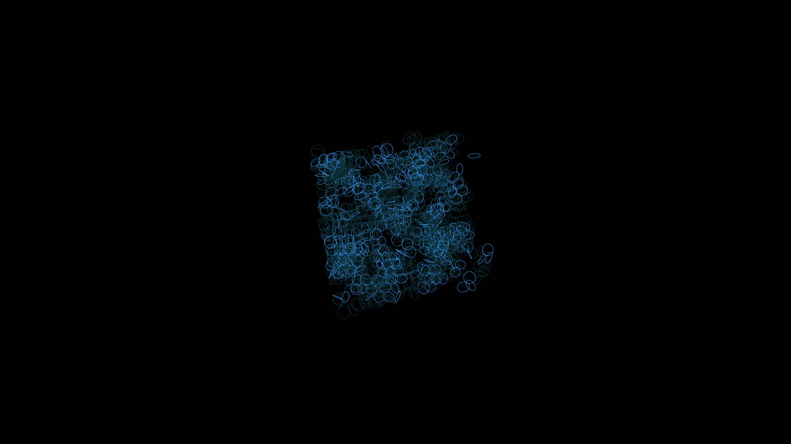

# quantum_spin_foam_3d

## Metadata
- **Date**: 2026-05-31
- **Theme**: A microscopic look at quantum spin foam, represented as interlocking 3D rings that constantly flip o
- **Technique**: 3D generative layout of `py5.ellipse` objects using `py5.rotate_x` and `py5.rotate_y` driven by Perlin noise, creating a shifting interconnected mesh of quantum loops.
- **Logic Lab Reference**: 

## Concept
A microscopic look at quantum spin foam, represented as interlocking 3D rings that constantly flip orientations and flash brightly when they connect.

## Technical Details
- **Renderer**: Unknown
- **Simulation**: Unknown
- **Visuals**: Unknown
- **Animation**: Unknown
