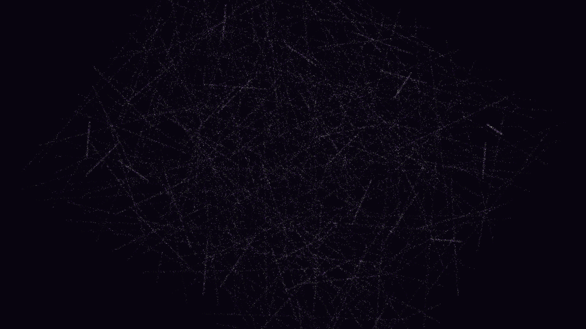

# quantum_spin_liquid_entanglement

## Metadata
- **Date**: 2026-05-16
- **Theme**: - **Theme**: Quantum Spin Liquids (QSLs) and Resonating Valence Bonds (RVB)
- **Technique**: Unknown
- **Logic Lab Reference**: 

## Concept
- **Theme**: Quantum Spin Liquids (QSLs) and Resonating Valence Bonds (RVB).
- **Technique**: Vectorized triangular lattice spin system with stochastic dimer-swapping (RVB) dynamics and tracer-based entanglement trails.
- **Description**: A fluid, shimmering web of entangled spin-dimers in deep amethyst and electric lime, illustrating the resonating nature of quantum spin liquids.

## Technical Details
- **Renderer**: Unknown
- **Simulation**: Unknown
- **Visuals**: Unknown
- **Animation**: Unknown
