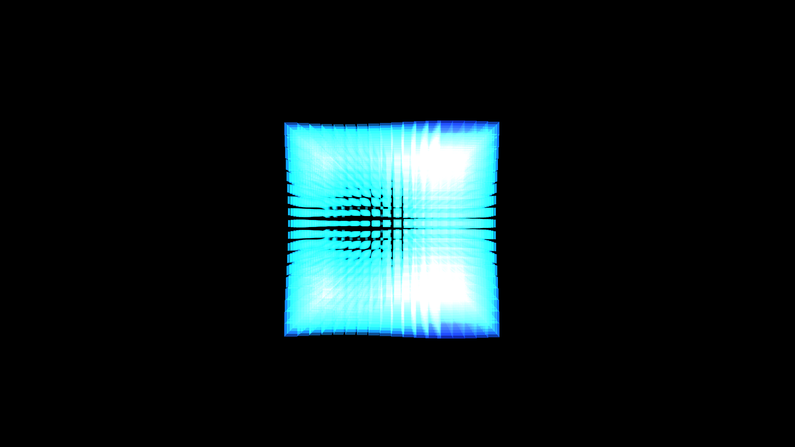

# quantum_supercomputer_voxel_core_3d

## Metadata
- **Date**: 2026-05-31
- **Theme**: Generative Art
- **Technique**: A 3D grid of `py5.box()` primitives. The size, brightness, and hue of each individual voxel are controlled by a complex trigonometric 3D interference pattern (combining sine and cosine waves mapped to spatial coordinates). The global time phase is modulated to ensure the 5,000+ voxels pulse and loop seamlessly over exactly 10 seconds.
- **Logic Lab Reference**: 

## Concept
No concept description provided.

## Technical Details
- **Renderer**: Unknown
- **Simulation**: Unknown
- **Visuals**: Unknown
- **Animation**: Contains animation details
