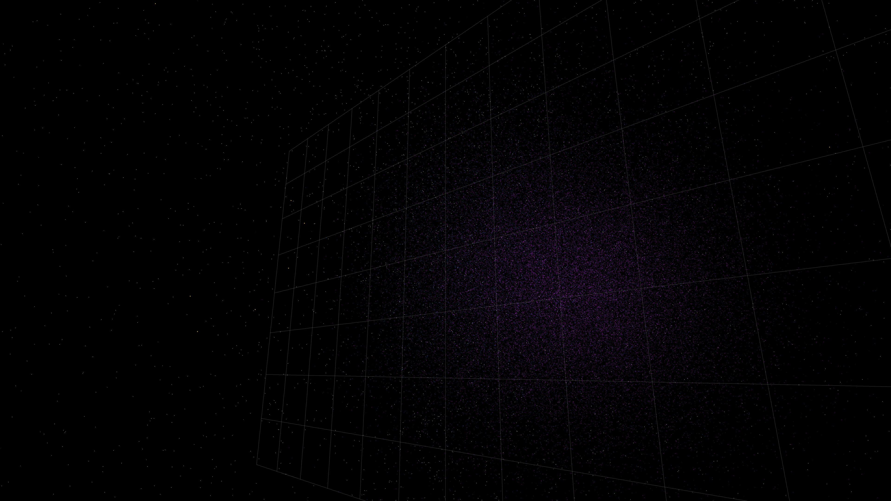

# quantum_tunneling_resonance

## Metadata
- **Date**: 2026-05-07
- **Theme**: Quantum tunneling, wave packet interference, potential barrier, beautiful night sky.
- **Technique**: 3D particle simulation (160,000 particles) modeling wave packet dynamics. Particles follow paths guided by incident, reflected (interference), and tunneled ($T \approx 0.05$) wavefunction components at a potential barrier. Features multi-pass additive rendering with HSB spectral mapping (Violet/Cyan/Gold) and a high-density starfield (12,000 stars). 60fps high-bitrate MP4.
- **Logic Lab Reference**: None

## Concept
A majestic vision of quantum mechanics; iridescent waves of electric violet and cyan crash against an invisible wall, rippling backward in complex fringes while a needle-sharp beam of white-gold light "leaks" through the barrier and vanishes into the deep obsidian night.

## Technical Details
- **Renderer**: P3D
- **Simulation**: particle, 3D particle.
- **Visuals**: additive blending, HSB spectral mapping, bloom-like highlights, prismatic color, dark-field contrast.
- **Animation**: 10 seconds at 60fps
