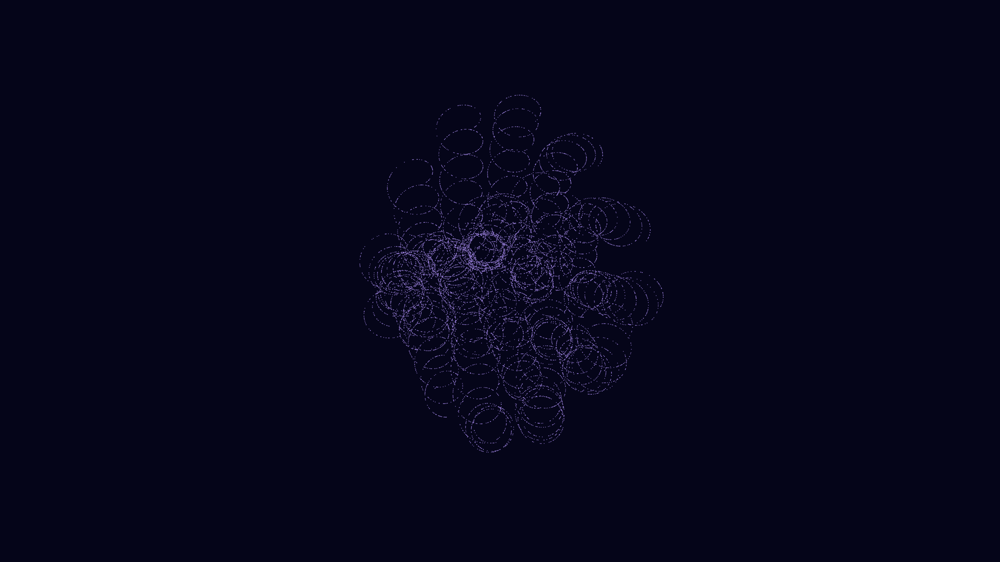

# quantum_vortex_lattice

## Metadata
- **Date**: 2026-05-07
- **Theme**: Quantum vortices, superfluidity, vortex lattice, topological defects, beautiful night sky.
- **Technique**: 3D simulation of a rotating superfluid with 19 quantized vortices in a hexagonal lattice. Implements helical Kelvin waves and a "melting" phase transition into turbulence. 30,000 particles are advected along the vortex cores. Features a transition from ordered Cyan/Indigo to chaotic shimmering Gold. 60fps high-bitrate MP4.
- **Logic Lab Reference**: None

## Concept
A macroscopic window into the quantum world; a perfect, shimmering lattice of vertical silk-like threads rotates in a deep blue void, before erupting into a chaotic and beautiful dance of tangled loops and swirling golden dust.

## Technical Details
- **Renderer**: P3D
- **Simulation**: particle.
- **Visuals**: HSB spectral mapping, bloom-like highlights, prismatic color, dark-field contrast.
- **Animation**: 10 seconds at 60fps
