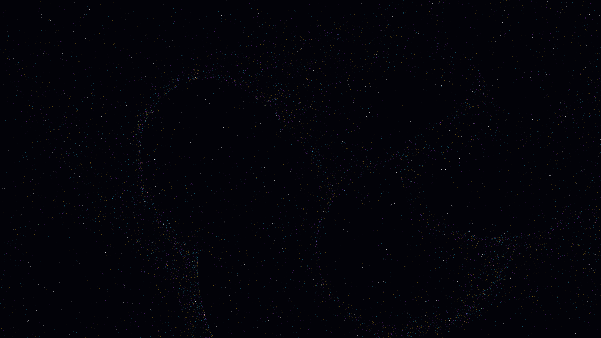

# quantum_vorticity

## Metadata
- **Date**: 2026-05-05
- **Theme**: Superfluid turbulence, quantized vortices, liquid light, beautiful night sky.
- **Technique**: Vectorized 30,000-particle advection along point-vortex velocity fields (Biot-Savart law), HSB spectral mapping, high-density starfield rendering.
- **Logic Lab Reference**: None

## Concept
A shimmering visualization of quantum turbulence where 30,000 silken filaments in electric cyan, royal amethyst, and gold swirl around invisible singularities; the intricate tapestry of phase-space resonance pulses against a darkest indigo midnight void.

## Technical Details
- **Renderer**: P2D
- **Simulation**: particle.
- **Visuals**: HSB spectral mapping, bloom-like highlights, prismatic color, dark-field contrast.
- **Animation**: 10 seconds at 60fps
