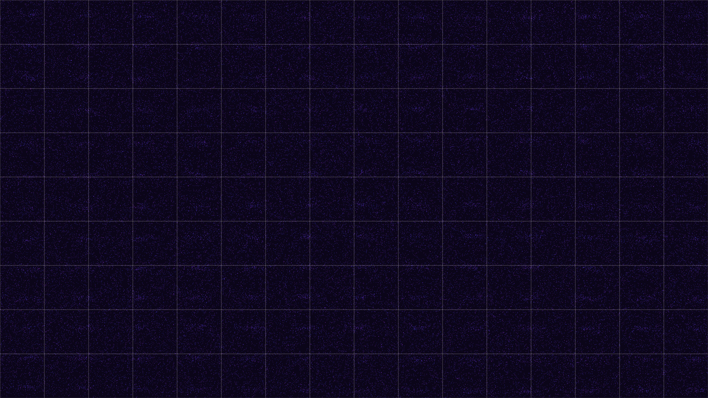

# quantum_zeno_decoherence

## Metadata
- **Date**: 2026-05-16
- **Theme**: A 15-second 4K/60fps animation exploring the Quantum Zeno effect—where constant observation freezes 
- **Technique**: Stochastic state-switching simulation. A central probability density field is periodically "projected" by high-frequency observation pulses (rendered as sharp, transient geometric grids). When the pulse frequency fluctuates, the system undergoes rapid "decoherence" bursts, visualized through vectorized particle fragmentation with high-intensity chromatic aberration and horizontal "pixel-shredding" glitch artifacts.
- **Logic Lab Reference**: 

## Concept
A 15-second 4K/60fps animation exploring the Quantum Zeno effect—where constant observation freezes a system's evolution—and the resulting decoherence that erupts when observation fluctuates.

## Technical Details
- **Renderer**: Unknown
- **Simulation**: Unknown
- **Visuals**: Unknown
- **Animation**: Contains animation details
