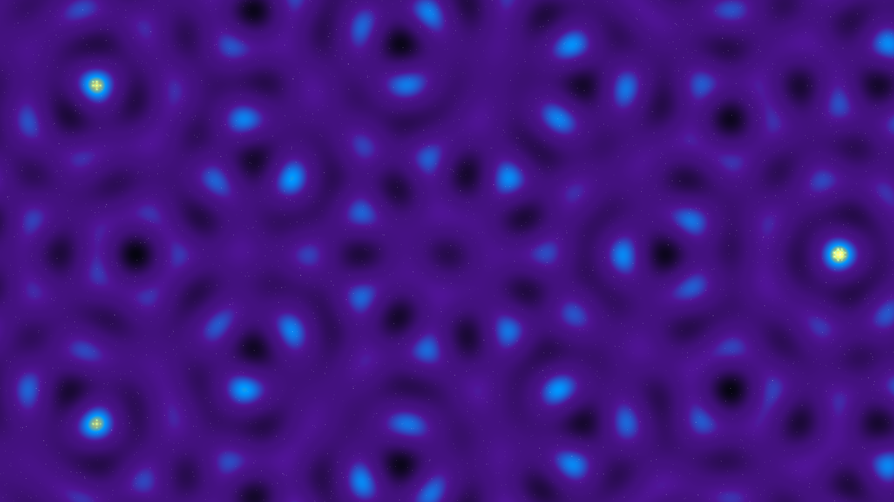

# quasicrystal_void

## Metadata
- **Date**: 2026-05-05
- **Theme**: Aperiodic resonance, cosmic order, quantum vacuum, beautiful night sky.
- **Technique**: Quasicrystal wave interference (7-fold plane wave summation), vectorized NumPy field rendering, iridescent multi-stop color mapping, additive focal glows, high-density starfield.
- **Logic Lab Reference**: None

## Concept
An intricate, shimmering field of aperiodic energy that pulses through a deep star-dusted void; the complex interference of 7 plane waves creates an iridescent tapestry of royal amethyst, electric cyan, and stellar gold that never repeats, revealing the hidden mathematical architecture of the vacuum.

## Technical Details
- **Renderer**: P2D
- **Simulation**: Vectorized NumPy, NumPy.
- **Visuals**: additive blending, bloom-like highlights, dark-field contrast.
- **Animation**: Still image
