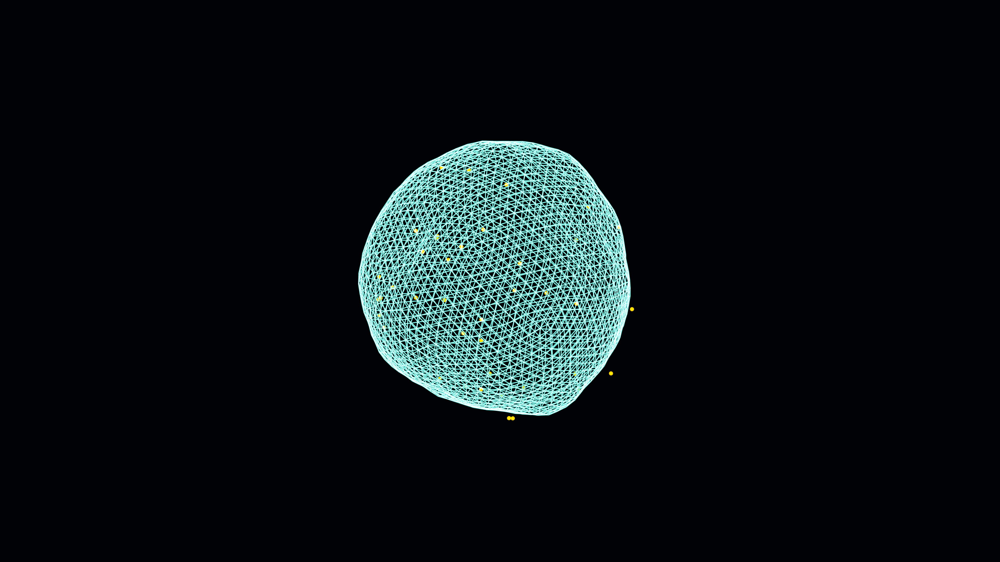

# radiolarian_pulse

## Metadata
- **Date**: 2026-05-03
- **Theme**: marine biology, geometry, deep sea, organic pulse.
- **Technique**: icosphere subdivision, spherical inversion, 3D Perlin noise, layered SCREEN blending, particle glow.
- **Logic Lab Reference**: None

## Concept
A bioluminescent microscopic skeleton pulses and inverts through its own center; bone-white and electric-cyan geometric threads form an intricate lattice surrounded by drifting gold marine snow against a deep abyss.

## Technical Details
- **Renderer**: P3D
- **Simulation**: particle.
- **Visuals**: bloom-like highlights, dark-field contrast.
- **Animation**: 5 seconds at 60fps
