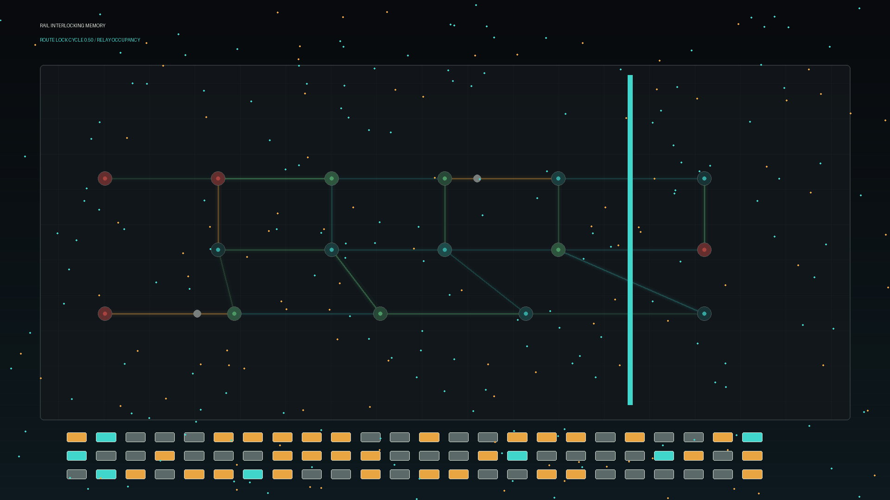

# rail_interlocking_memory

## Metadata
- **Date**: 2026-05-26
- **Theme**: Generative Art
- **Technique**: This 10-second 60fps animation renders a track-circuit interlocking board with glowing route edges, relay occupancy blocks, signal nodes, moving scan beams, and sparse electrical dust. The palette uses graphite, muted rail steel, cyan, green, amber, and red.
- **Logic Lab Reference**: 

## Concept
No concept description provided.

## Technical Details
- **Renderer**: Unknown
- **Simulation**: Unknown
- **Visuals**: Unknown
- **Animation**: Contains animation details
