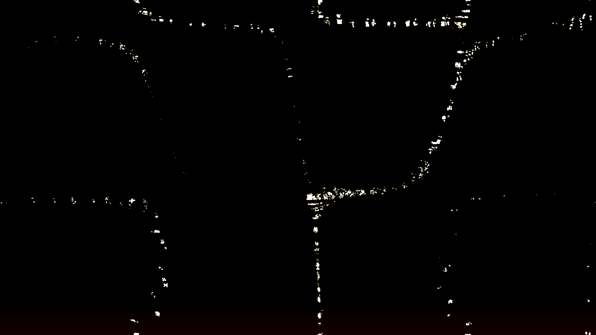

# rayleigh_benard_convection_cells

## Metadata
- **Date**: 2026-05-11
- **Theme**: Fluid dynamics, thermodynamics, thermal convection, Rayleigh-Bénard instability, self-organization.
- **Technique**: 2D particle advection simulation. Tracers are guided by a dynamic velocity field derived from a hexagonal convection roll model. Features multi-pass additive rendering with a "Molten Copper / Solar Amber / Obsidian" palette. 20s 4K/60fps MP4.
- **Logic Lab Reference**: None

## Concept
A dark, viscous surface boils with organized cells of molten copper and golden light, revealing the elegant self-organization of a heated fluid.

## Technical Details
- **Renderer**: P2D
- **Simulation**: particle.
- **Visuals**: additive blending, dark-field contrast.
- **Animation**: 20 seconds at 60fps
