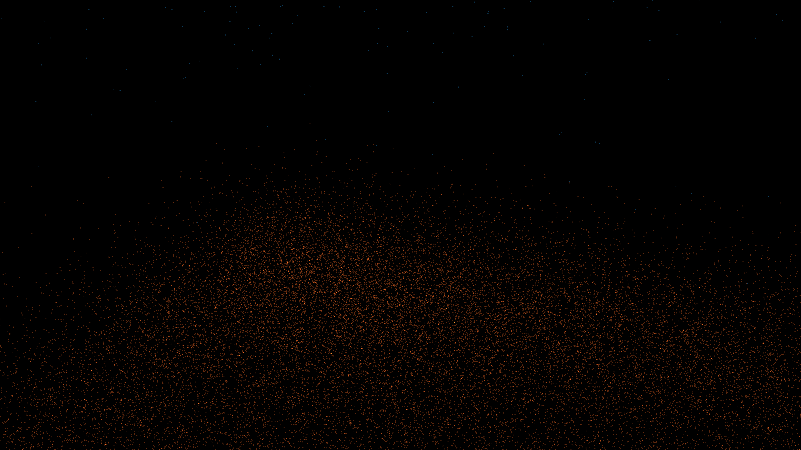

# rayleigh_taylor_plumes

## Metadata
- **Date**: 2026-05-10
- **Theme**: Fluid dynamics, Rayleigh-Taylor instability, buoyancy-driven mixing, beautiful night sky.
- **Technique**: 3D particle simulation (100,000 particles) advected by a vectorized buoyant force field and 16 dynamic plume centers. Implements the growth of "mushrooms" and "spikes" through a dual-fluid interface. Features manual 3D-to-2D projection for performance and stability.
- **Logic Lab Reference**: None

## Concept
A majestic visualization of two cosmic fluids mixing under gravity. Heavy, glowing plumes of molten orange sink into a deep blue sea, while silken azure filaments rise in response, creating a complex, shimmering interface of light and shadow reminiscent of a nocturnal atmospheric event.

## Technical Details
- **Renderer**: P2D
- **Simulation**: particle, 3D particle.
- **Visuals**: additive blending.
- **Animation**: 20 seconds at 60fps
