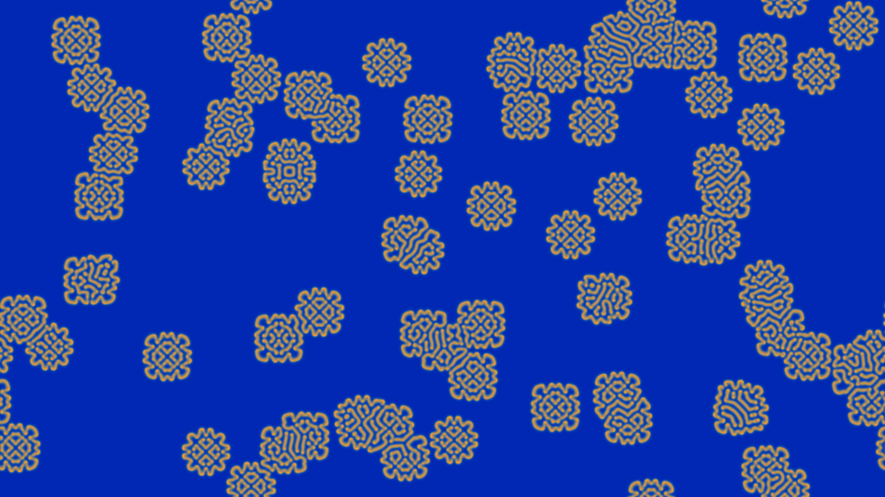

# Reaction Diffusion

A Gray-Scott reaction-diffusion system simulated over 2000 steps. Two virtual chemicals interact — activator and inhibitor — spontaneously forming labyrinthine floral clusters reminiscent of coral, lichen, or animal markings. Each cluster grows a unique internal maze from the same simple chemical rules.
