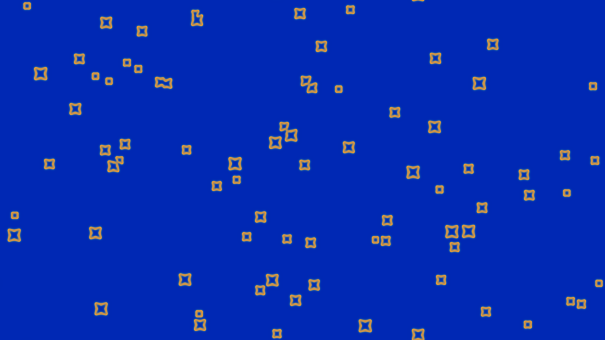

# reaction_diffusion

## Metadata
- **Date**: 2026-04-25
- **Theme**: biology, emergence, self-organization.
- **Technique**: Gray-Scott reaction-diffusion PDE, numpy simulation, 2000 steps.
- **Logic Lab Reference**: None

## Concept
Labyrinthine floral clusters formed by two interacting virtual chemicals, resembling coral or animal markings.

## Technical Details
- **Renderer**: P2D
- **Simulation**: NumPy, reaction-diffusion.
- **Visuals**: layered py5 drawing.
- **Animation**: Still image
