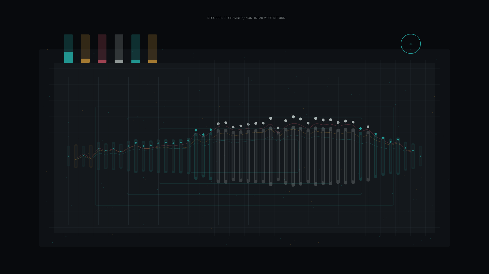

# recurrence_chamber

## Metadata
- **Date**: 2026-05-19
- **Theme**: A dark instrument chamber where nonlinear vibration briefly loses order, then remembers its first tone.
- **Technique**: FPUT-inspired alpha lattice integration with velocity Verlet updates, modal projection, recurrence ratio visualization, resonator bars, and energy-band traces.
- **Logic Lab Reference**: Fermi-Pasta-Ulam-Tsingou recurrence model, implemented directly from coupled nonlinear oscillator equations.

## Concept
`recurrence_chamber` treats a nonlinear oscillator chain as a modern laboratory instrument. Vertical resonators bend with the lattice displacement while small mode meters and rectangular recurrence pulses reveal energy leaving the fundamental tone and later returning, like a room remembering a sound after it has scattered.

## Technical Details
- **Renderer**: P2D
- **Simulation**: Alpha-FPUT coupled oscillator lattice with fixed boundaries, velocity Verlet integration, and sine-mode projection
- **Visuals**: Graphite chamber grid, cyan/amber displacement polarity, rose high-mode energy, silver recurrence peaks
- **Animation**: 12 seconds at 60fps, generating `output.mp4` and `recurrence_chamber_p1.png`
