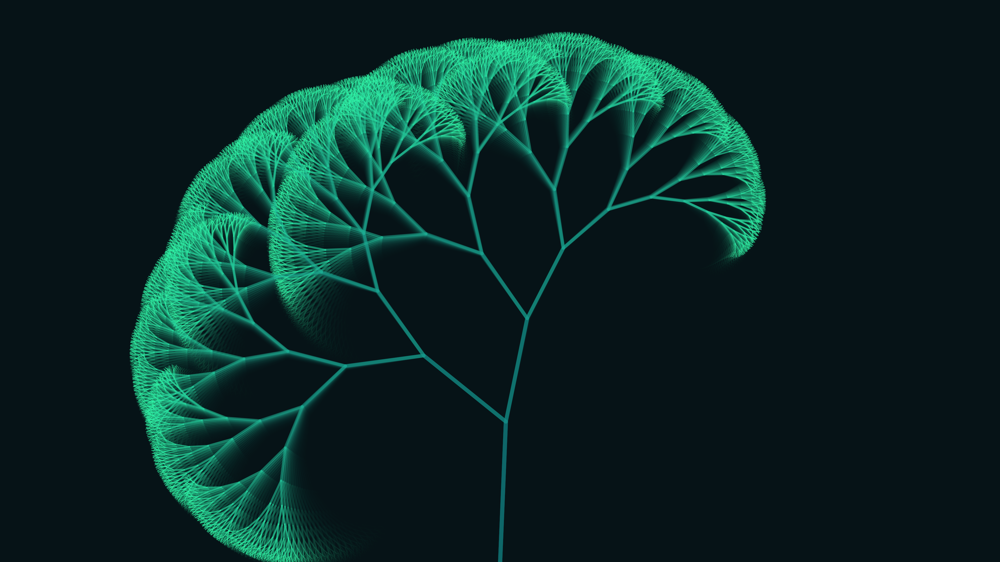

# recursive_anemone_fractal_tree_2d

## Metadata
- **Date**: 2026-06-30
- **Theme**: An intricate, swaying recursive fractal tree structure that visually resembles a bioluminescent sea 
- **Technique**: A pure recursive branching algorithm (L-system inspired). Each branch spawns two sub-branches, repeating for 12 levels of depth (resulting in thousands of simultaneous lines). Rather than using static angles, the branching spread is driven by `py5.os_noise` (OpenSimplex noise) parameterized by time and recursion depth. This gives the entire structure a unified, fluid motion. The stroke thickness and color are remapped based on the depth of the branch, transitioning from a thick, deep teal trunk to fine, bright green tips. Subtractive blending smoothly erases old frames to create motion blur.
- **Logic Lab Reference**: 

## Concept
An intricate, swaying recursive fractal tree structure that visually resembles a bioluminescent sea anemone or kelp breathing in a deep ocean current.

## Technical Details
- **Renderer**: Unknown
- **Simulation**: Unknown
- **Visuals**: Unknown
- **Animation**: Contains animation details
