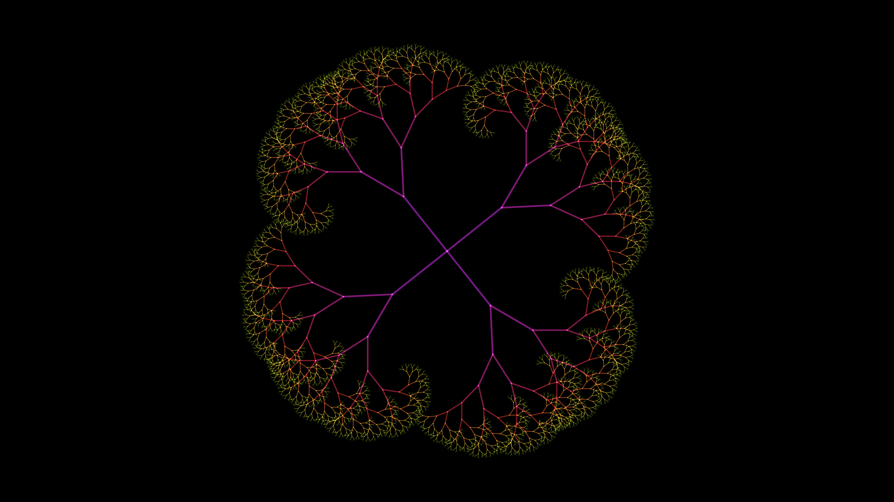

# recursive_fractal_canopy

## Metadata
- **Date**: 2026-05-27
- **Theme**: - **Date**: 2026-05-27 - **Theme**: A surreal, infinite fractal canopy of glowing crystalline branch
- **Technique**: Unknown
- **Logic Lab Reference**: 

## Concept
- **Date**: 2026-05-27
- **Theme**: A surreal, infinite fractal canopy of glowing crystalline branches that sway as if underwater.
- **Technique**: A recursive 2D branching tree drawn from the center, using sinusoidal rotations to simulate an underwater current. The color shifts dynamically with depth and time.
- **Description**: A fractal tree structure with glowing crystalline branches.

## Technical Details
- **Renderer**: Unknown
- **Simulation**: Unknown
- **Visuals**: Unknown
- **Animation**: Unknown
