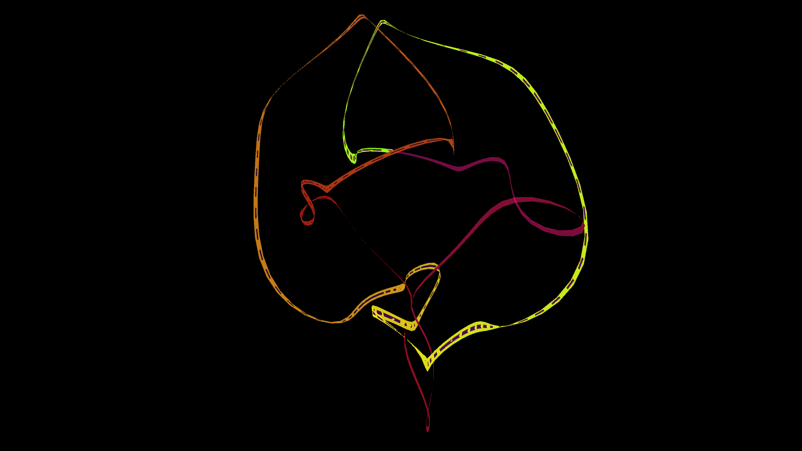

# recursive_fractal_spirograph

A brilliantly glowing ribbon of rainbow light dances wildly in the center of a black abyss. Like an invisible, multi-jointed pendulum swinging in all three dimensions, it draws an intricate, chaotic, yet perfectly mathematical knot. 

The glowing trail slowly fades into darkness at its tail, creating a beautiful long-exposure photography effect, as the entire 3D construct smoothly rotates before the viewer.
