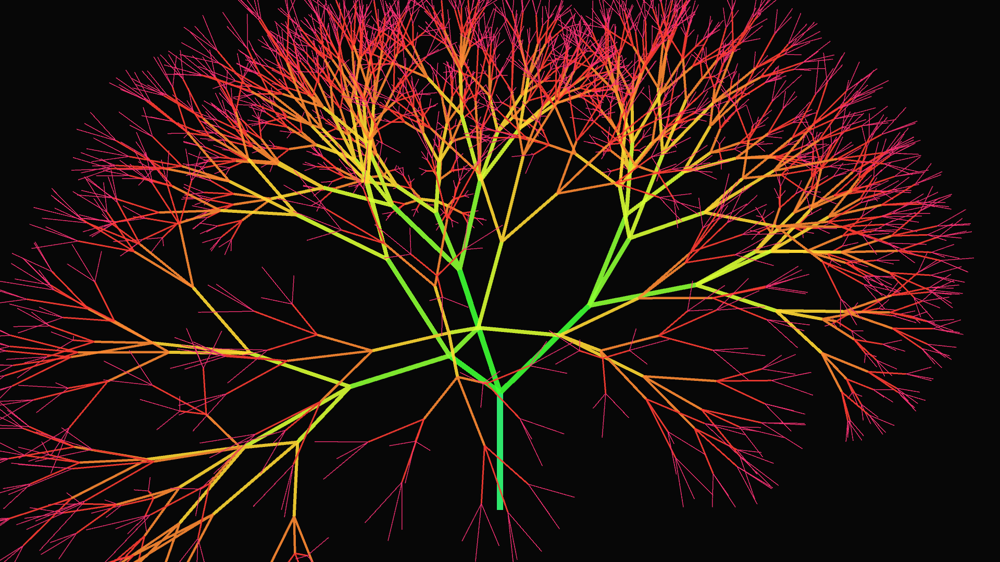

# recursive_fractal_tree_3d

## Metadata
- **Date**: 2026-05-23
- **Theme**: A fully 3D recursive fractal tree that slowly "breathes" as its branching angles oscillate
- **Technique**: Unknown
- **Logic Lab Reference**: 

## Concept
A fully 3D recursive fractal tree that slowly "breathes" as its branching angles oscillate.

- **Date**: 2026-05-23
- **Theme**: Algorithmic botany, L-systems, fractal geometry, nature emulation.
- **Technique**: Uses a classic recursive function (`draw_branch`) in P3D to build a fractal tree with a maximum depth of 8. Unlike simple 2D L-systems, this tree branches out in 3 directions at every node, distributed radially around the local Y-axis. The entire structure is composed of thousands of overlapping lines. The branching angle is driven by a sine wave based on time and the current depth, causing the tree to smoothly expand and contract as if breathing or swaying in an unseen underwater current. The color transitions from a deep magenta trunk to bright cyan/green "leaves" at the outermost tips. 15s 60fps MP4.
- **Description**: A mesmerizing, neon-lit digital tree grows from the bottom of a dark void. It branches out in full 3D space, with thousands of delicate geometric twigs. The entire massive structure slowly rotates while gracefully expanding and contracting. The colors smoothly pulse along its depth, giving the mathematical fractal a deeply organic and hypnotic, lifelike quality.

## Technical Details
- **Renderer**: P3D
- **Simulation**: Unknown
- **Visuals**: Unknown
- **Animation**: Contains animation details
