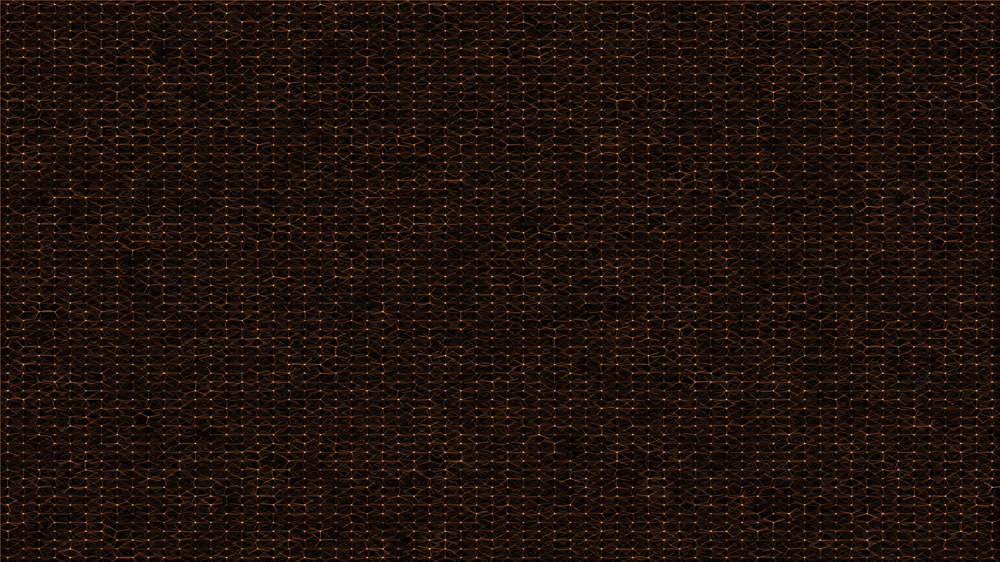

# recursive_interference

## Metadata
- **Date**: 2026-05-04
- **Theme**: Recursive physics, multi-scale interference, digital optics, complex resonance.
- **Technique**: Quadtree subdivision driven by moving noise, persistent PGraphics accumulation for temporal glow, triple-shard interference emission, additive spectral highlights.
- **Logic Lab Reference**: None

## Concept
An incredibly dense, shimmering tapestry of light fringes where the frequency and density of wave emitters are determined by a recursive quadtree; the result is a multi-scale interference field that pulses with organic-yet-digital life against a deep navy night.

## Technical Details
- **Renderer**: P2D
- **Simulation**: Quadtree subdivision driven by moving noise, persistent PGraphics accumulation for temporal glow, triple-shard interference emission, additi.
- **Visuals**: additive blending, HSB spectral mapping, persistent trails, bloom-like highlights, prismatic color, dark-field contrast.
- **Animation**: 10 seconds at 60fps
