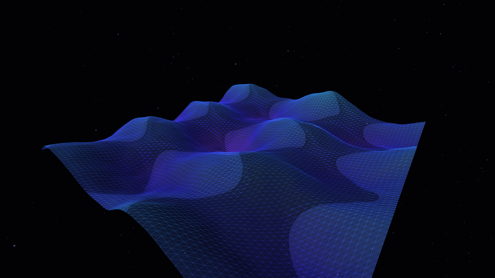

# recursive_membranes

## Metadata
- **Date**: 2026-05-05
- **Theme**: Dimensional folding, iridescent surfaces, organic geometry, beautiful night sky
- **Technique**: 3D noise-warped mesh (P3D), height-based HSB iridescence mapping, translucent layering, dynamic camera rotation, high-density starfield

## Concept
A shimmering, translucent veil of light that folds and pulses in a deep void; the noise-warped membranes in electric cyan and royal amethyst create an intricate, pearlescent tapestry of geometric resonance under a silent, star-dusted midnight sky.

## Technical Details
- **Renderer**: P3D
- **Simulation**: 3D noise-warped mesh (P3D)
- **Visuals**: height-based HSB iridescence mapping, translucent layering, dynamic camera rotation, high-density starfield
- **Animation**: 10s @ 60fps (typical)
