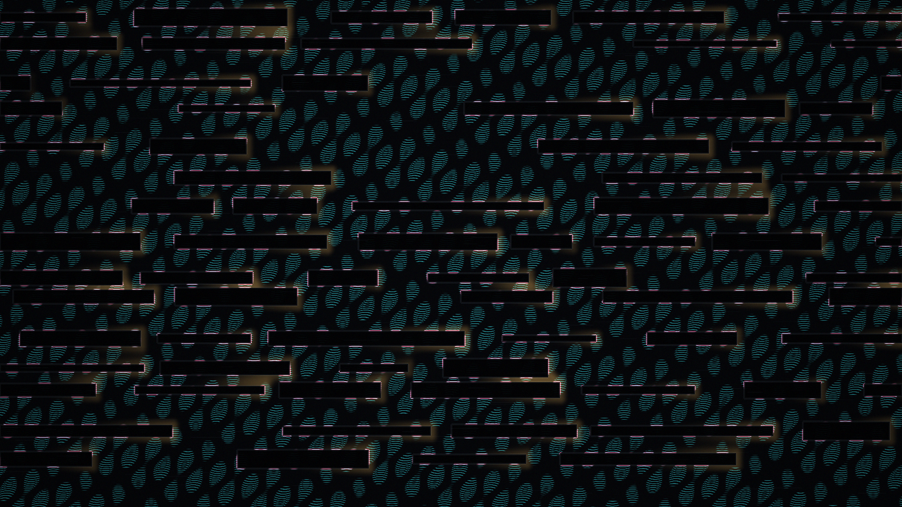

# redaction_current

## Metadata
- **Date**: 2026-05-03
- **Theme**: censorship, suppressed communication, signal leakage, modern abstraction.
- **Technique**: Redaction block field, sinusoidal signal leakage, wake accumulation around barriers, ghost baseline synthesis.
- **Logic Lab Reference**: None

## Concept
A document-like dark field is crossed by hard black redaction bars while cyan currents, magenta edge residue, and muted amber wakes leak around the blocks, suggesting a suppressed message that still carries charge.

## Technical Details
- **Renderer**: P2D
- **Simulation**: Redaction block field, sinusoidal signal leakage, wake accumulation around barriers, ghost baseline synthesis.
- **Visuals**: bloom-like highlights, dark-field contrast.
- **Animation**: Still image
