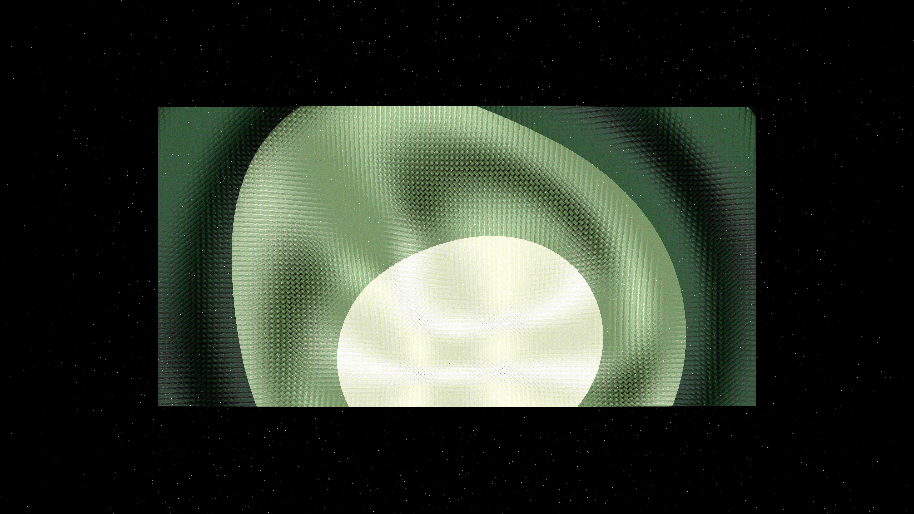

# relativistic_caustic_drift

## Metadata
- **Date**: 2026-05-07
- **Theme**: Gravitational caustics, relativistic drift, light warping, beautiful night sky.
- **Technique**: 3D particle simulation (180,000 particles) using a vectorized deflection model with 4 dynamic gravitational hubs. Features multi-pass additive rendering with influence-weighted spectral mapping (Cyan/Silver/Gold) and a high-density starfield (12,000 stars). 60fps high-bitrate MP4.
- **Logic Lab Reference**: None

## Concept
A mesmerizing vision of light warping in the deep cosmos; liquid-like ribbons of electric cyan and silver energy drift and warp across the void, erupting into intense white-gold caustic networks wherever invisible mass centers concentrate the light against the star-dusted night.

## Technical Details
- **Renderer**: P3D
- **Simulation**: particle, 3D particle.
- **Visuals**: additive blending, HSB spectral mapping, prismatic color, dark-field contrast.
- **Animation**: 10 seconds at 60fps
