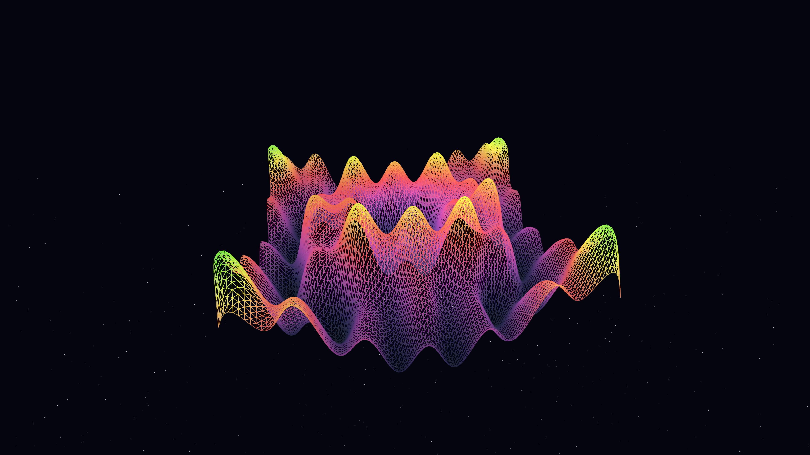

# resonant_void

## Metadata
- **Date**: 2026-05-04
- **Theme**: Cosmic resonance, gravitational waves, shimmering energy, beautiful night sky
- **Technique**: 3D harmonic mesh deformation (P3D), multi-frequency sine superposition, HSB spectral mapping, atmospheric starfield rendering

## Concept
A central, vibrating energy membrane pulses with multiple overlapping harmonic frequencies in a deep star-dusted void; the shimmering surface shifts between electric cyan and royal amethyst, leaving glowing spectral echoes as it rotates through the silent indigo sky.

## Technical Details
- **Renderer**: P3D
- **Simulation**: 3D harmonic mesh deformation (P3D)
- **Visuals**: multi-frequency sine superposition, HSB spectral mapping, atmospheric starfield rendering
- **Animation**: 10s @ 60fps (typical)
