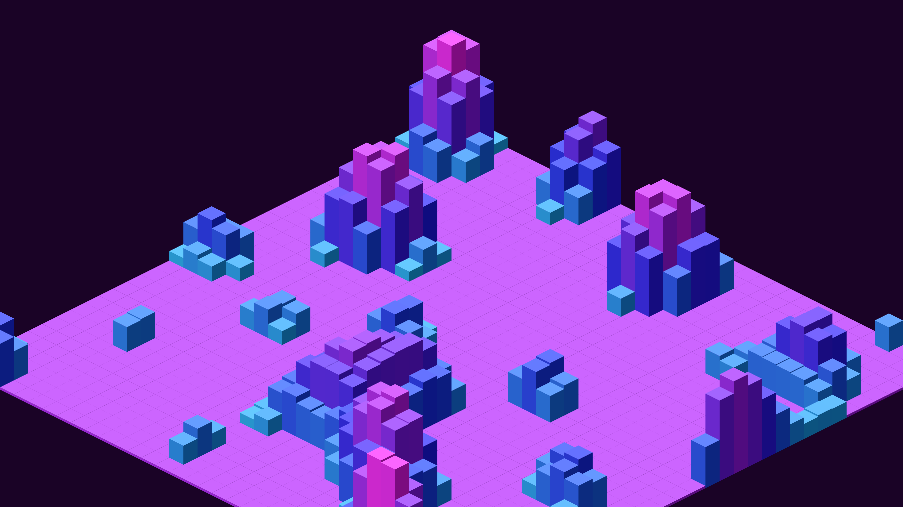

# retro_pixel_art_isometric_cityscape_2d

## Metadata
- **Date**: 2026-06-15
- **Theme**: An animated 15s sequence of a scrolling 2D isometric pixel-art cityscape with glowing neon tops
- **Technique**: Isometric 2D math (`x = (c - r) * w`, `y = (c + r) * h/2 - z`) is used to project cubes in a 3D space from back to front using a painter's algorithm. The heights of the cubes are mapped from `py5.os_noise` which shifts over time to create a continuous scrolling effect. Taller buildings have cyan to pink glowing tops.
- **Logic Lab Reference**: 

## Concept
An animated 15s sequence of a scrolling 2D isometric pixel-art cityscape with glowing neon tops.

## Technical Details
- **Renderer**: Unknown
- **Simulation**: Unknown
- **Visuals**: Unknown
- **Animation**: Unknown
