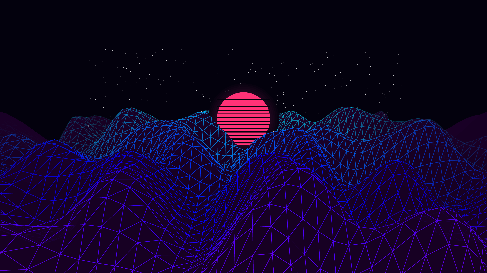

# retrowave_endless_neon_terrain_3d

## Metadata
- **Date**: 2026-06-13
- **Theme**: A classic retro-synthwave infinite wireframe grid driving into a digital sunset, featuring rolling m
- **Technique**: A 3D grid drawn using `py5.begin_shape(py5.TRIANGLE_STRIP)`. The Z-axis terrain height is determined by 2D Perlin noise that translates over time to simulate forward motion. Includes a glowing synthwave sun with procedurally generated scanlines and additive blending for neon effects.
- **Logic Lab Reference**: 

## Concept
A classic retro-synthwave infinite wireframe grid driving into a digital sunset, featuring rolling mountains that shift continuously under a deep purple sky.

## Technical Details
- **Renderer**: Unknown
- **Simulation**: Unknown
- **Visuals**: Unknown
- **Animation**: Animation (20s @ 60fps)
