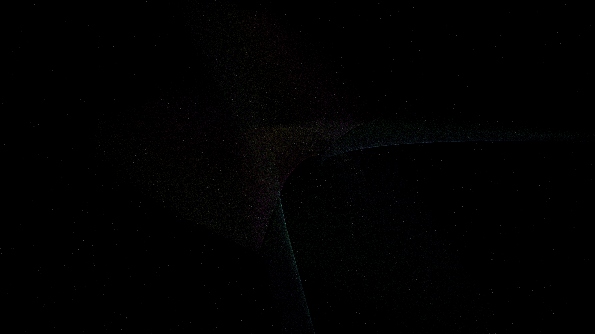

# riemann_surface_unfolding

## Metadata
- **Date**: 2026-05-08
- **Theme**: Riemann surfaces, complex analysis, mathematical topology, high-dimensional manifolds, beautiful night sky.
- **Technique**: 3D simulation of a complex manifold for $w^2 = z^3 - z$. The surface is rendered via 180,000 particles advected along the phase-gradient vector field of the complex potential. Implements multi-sheet topology where particles transition between sheets based on branch point proximity. Features multi-pass additive rendering with an iridescent "Spectral" HSB palette and a high-density background starfield (12,000 stars). 60fps high-bitrate MP4.
- **Logic Lab Reference**: None

## Concept
A mesmerizing vision of mathematical beauty; a complex geometric surface unfolds and breathes in the void, its iridescent sheets swirling with silken threads of light that trace the hidden paths of complex functions against the star-dusted obsidian night.

## Technical Details
- **Renderer**: P3D
- **Simulation**: particle.
- **Visuals**: additive blending, HSB spectral mapping, prismatic color.
- **Animation**: 20 seconds at 60fps
