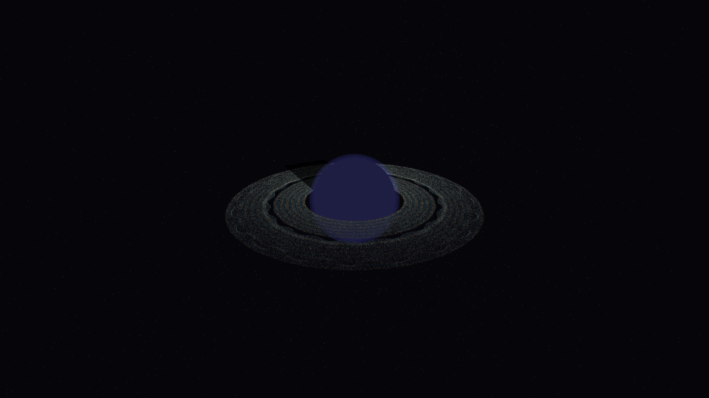

# ring_resonance_void

## Metadata
- **Date**: 2026-05-10
- **Theme**: Planetary rings, orbital resonance, shepherd moons, beautiful night sky.
- **Technique**: 3D orbital simulation (180,000 particles) using vectorized NumPy for Keplerian dynamics. Features a perturbation model where invisible shepherd moons create density "wakes" and resonance gaps in a thin silken disk. Multi-pass rendering includes a background starfield, additive spectral ring particles (Pale Gold/Ice Blue), and a planetary shadow simulation. 60fps high-bitrate MP4.
- **Logic Lab Reference**: None

## Concept
A majestic visualization of a planetary ring system seen from an oblique angle; nearly 200,000 silken particles swirl in complex orbital resonance, revealing delicate wave patterns and sharp gaps carved by the gravity of invisible moons against a silent, star-dusted night sky.

## Technical Details
- **Renderer**: P3D
- **Simulation**: Vectorized NumPy, NumPy, particle.
- **Visuals**: additive blending, HSB spectral mapping, prismatic color, dark-field contrast.
- **Animation**: 10 seconds at 60fps
