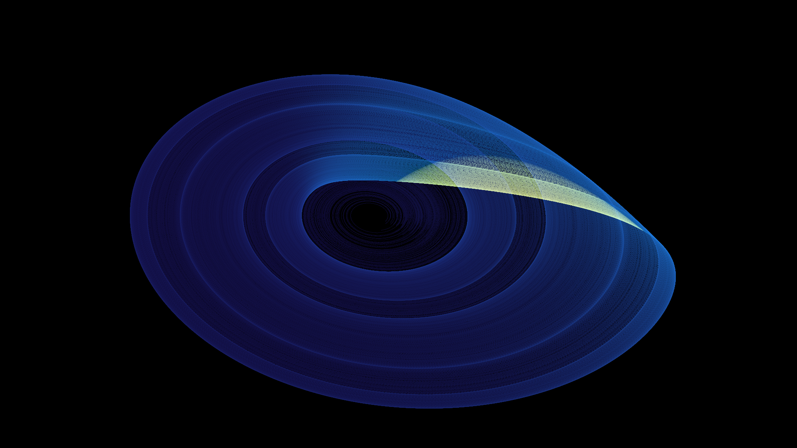

# rossler_attractor

## Metadata
- **Date**: 2026-04-26
- **Theme**: chaos theory, mathematics, physics, strange attractor.
- **Technique**: vectorised RK4 ODE (250 trajectories × 35k steps), z-height split into 3 density layers, additive colour compositing violet→teal→gold, log tone mapping.
- **Logic Lab Reference**: None

## Concept
The Rössler chaotic system rendered with z-height coloring; the spiral body glows violet, the snap-back fold burns gold, revealing the 3D fold structure in a (x,y) projection with depth as color.

## Technical Details
- **Renderer**: P2D
- **Simulation**: vectorised RK4 ODE (250 trajectories × 35k steps), z-height split into 3 density layers, additive colour compositing violet→teal→gold, log t.
- **Visuals**: additive blending, bloom-like highlights, dark-field contrast.
- **Animation**: Still image
