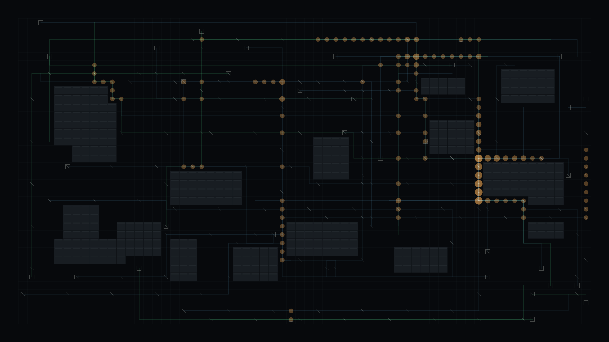

# route_arbitration

## Metadata
- **Date**: 2026-05-03
- **Theme**: autonomous negotiation, shared floor, routing pressure, operational intelligence.
- **Technique**: Obstacle-field generation, grid shortest-path routing, conflict heat accumulation, reservation tick glyphs.
- **Logic Lab Reference**: None

## Concept
A dark warehouse-like routing map shows steel-blue and green paths threading around matte blockers while amber conflict nodes and white priority markers reveal where autonomous decisions compete for the same floor.

## Technical Details
- **Renderer**: P2D
- **Simulation**: Obstacle-field generation, grid shortest-path routing, conflict heat accumulation, reservation tick glyphs.
- **Visuals**: bloom-like highlights, dark-field contrast.
- **Animation**: Still image
