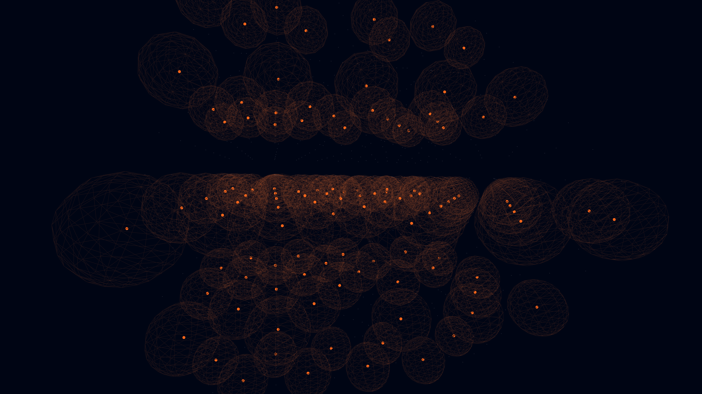

# rydberg_blockade_array

## Metadata
- **Date**: 2026-05-12
- **Theme**: Quantum computing, Rydberg atoms, dipole blockade, collective excitations.
- **Technique**: 3D grid simulation. Greedy blockade logic based on a wave potential. Multi-pass additive rendering with glowing shells (sphere geometry). 12s 4K/60fps MP4 (1080p source).
- **Logic Lab Reference**: None

## Concept
A precise 3D grid of neutral atoms, where laser excitations trigger blinding Neon Orange glows and translucent blockade shells that prevent neighboring atoms from being excited.

## Technical Details
- **Renderer**: P3D
- **Simulation**: 3D grid simulation.
- **Visuals**: additive blending, bloom-like highlights, dark-field contrast.
- **Animation**: 12 seconds at 60fps
