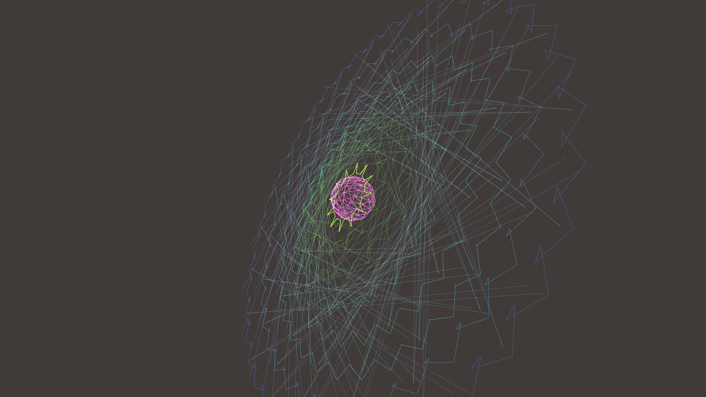

# sacred_geometry_mandala_bloom_3d

## Metadata
- **Date**: 2026-06-05
- **Theme**: Generative Art
- **Technique**: Procedurally generated 3D polar geometries consisting of stacked rotating rings and wireframe spheres. Additive blending and neon glow effects are combined with dynamic Z-axis oscillation to create a hypnotic, overlapping structural bloom.  
- **Logic Lab Reference**: 

## Concept
No concept description provided.

## Technical Details
- **Renderer**: Unknown
- **Simulation**: Unknown
- **Visuals**: Unknown
- **Animation**: Contains animation details
